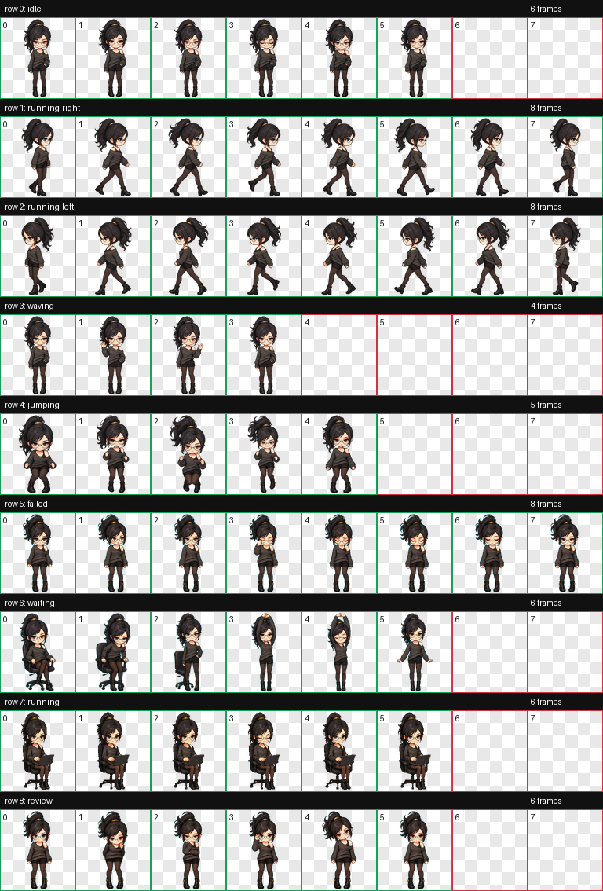
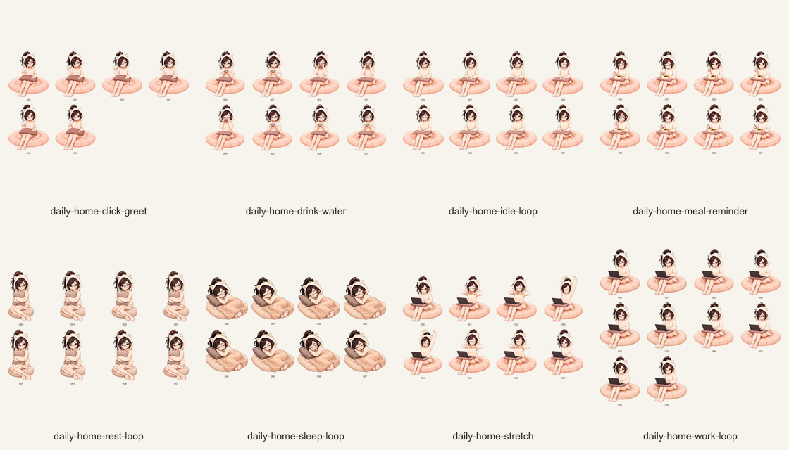

# Daily for Everby

Daily 是 Everby 的桌面宠物角色。本仓库同时提供可导入的角色本体，以及日常、居家、咖啡馆、办公室、健身和户外运动场景动作扩展。



## 直接安装

发布文件位于 `dist/`：

- `daily.zip`：Daily 角色本体。在 Everby 的“角色与人设”页面选择“导入角色”。
- `daily-routines.soulmotion`：欢呼、专注和舒展动作。在“动作 → 扩展包”中导入。
- `daily-home-companion.soulmotion`：居家服装与坐垫场景动作，在“动作 → 扩展包”中导入。
- `daily-rainy-cafe.soulmotion`：统一咖啡馆桌边坐姿的待机、工作、喝咖啡、点击回应和休息动作。
- `daily-office-work.soulmotion`：西装与白色办公桌场景的待机、办公、签字、点击回应和疲劳动作。
- `daily-fitness-warmups.soulmotion`：粉色运动装造型的哑铃弯举、肩臂、侧腰、弓步热身和喝水休息动作。
- `daily-outdoor-badminton.soulmotion`：白色运动装造型的待机、发球、正手击球、扣杀、庆祝和移动动作。

请先导入 `daily.zip`，再导入 `.soulmotion` 文件。所有动作包的 `targetPetId` 都是 `daily`。

## 居家动作包

居家动作包包含 8 个动作、64 帧：

- 抱枕待机
- 抱枕敲代码
- 工作间隙伸展
- 坐着喝水
- 坐着吃饭
- 抱枕休息
- 抱枕睡眠
- 坐姿挥手

所有动作使用统一的米白猫耳家居服、圆形坐垫和棕色抱枕。一次性事件动作结束后，由 Everby 恢复当前状态动作。



## 雨天咖啡馆动作包

咖啡馆动作包首版包含 5 个关键动作：桌边待机、持续工作、喝热咖啡、点击抬眼和捧杯休息。所有动作固定使用同一张桌子、椅子、电脑和咖啡杯，人物保持黑色针织外套与认真神态。

## 办公室动作包

办公室动作包包含 5 个关键动作：办公待机、日常办公、签字确认、抬眼回应和工作停顿。所有动作统一使用炭黑色西装、哑光白色办公桌与深绿色文件盘。

## 健身热身动作包

健身动作包包含持续哑铃弯举，以及肩臂绕环、左右侧腰拉伸、弓步压腿和喝水休息。所有动作统一使用粉色运动上衣、粉色头带、暖白运动裤和同一套瑜伽垫器材；一次性动作结束后恢复当前状态背景动画。

## 户外羽毛球动作包

羽毛球动作包包含球场待机、低手发球、正手击球、跃起扣杀、得分庆祝和侧向垫步。人物统一使用白色运动套装、粉色头带、深灰球拍和浅蓝色局部球场，不附加球网或水壶。

## 仓库结构

```text
dist/                         可直接导入的发布文件
pet/daily/                    Daily 角色本体源码
motions/daily-routines/       基础日常动作包源码
motions/daily-home-companion/ 居家陪伴动作包源码
motions/daily-rainy-cafe/      雨天咖啡馆动作包源码
motions/daily-office-work/     办公室工作动作包源码
motions/daily-fitness-warmups/ 健身热身动作包源码
motions/daily-outdoor-badminton/ 户外羽毛球动作包源码
previews/                     角色与动作预览图
```

角色图集采用 `8 × 9` 网格，每格 `192 × 208`。动作扩展遵循 `.soulmotion` format v1，画布尺寸为 `192 × 208`。

## 验证

在 Everby 项目根目录中可以运行：

```bash
node skills/everby-pet-install/scripts/validate-pet.mjs artifacts/git/everby-daily/pet/daily
pnpm motion:validate -- artifacts/git/everby-daily/dist/daily-routines.soulmotion
pnpm motion:validate -- artifacts/git/everby-daily/dist/daily-home-companion.soulmotion
pnpm motion:validate -- artifacts/git/everby-daily/dist/daily-rainy-cafe.soulmotion
pnpm motion:validate -- artifacts/git/everby-daily/dist/daily-office-work.soulmotion
pnpm motion:validate -- artifacts/git/everby-daily/dist/daily-fitness-warmups.soulmotion
pnpm motion:validate -- artifacts/git/everby-daily/dist/daily-outdoor-badminton.soulmotion
```

## License

代码与仓库内容按 [MIT License](LICENSE) 提供。涉及人物形象、第三方素材或再发布用途时，请自行确认对应授权范围。
